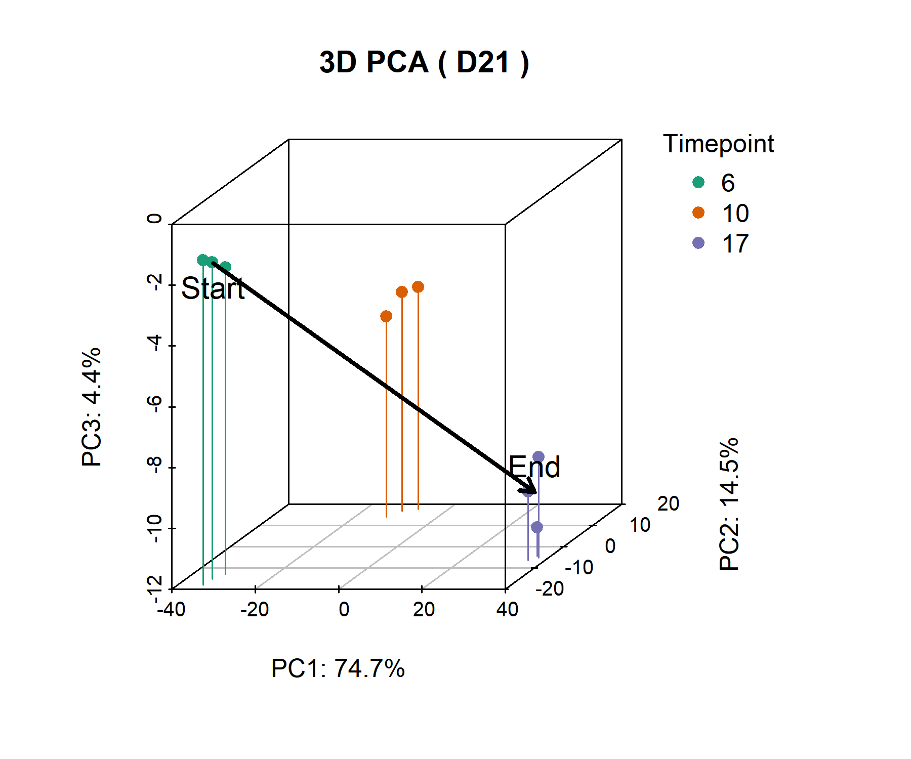
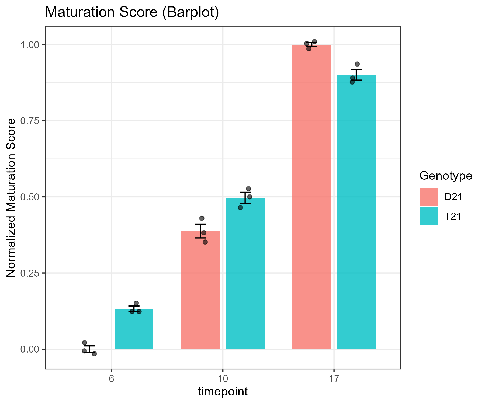
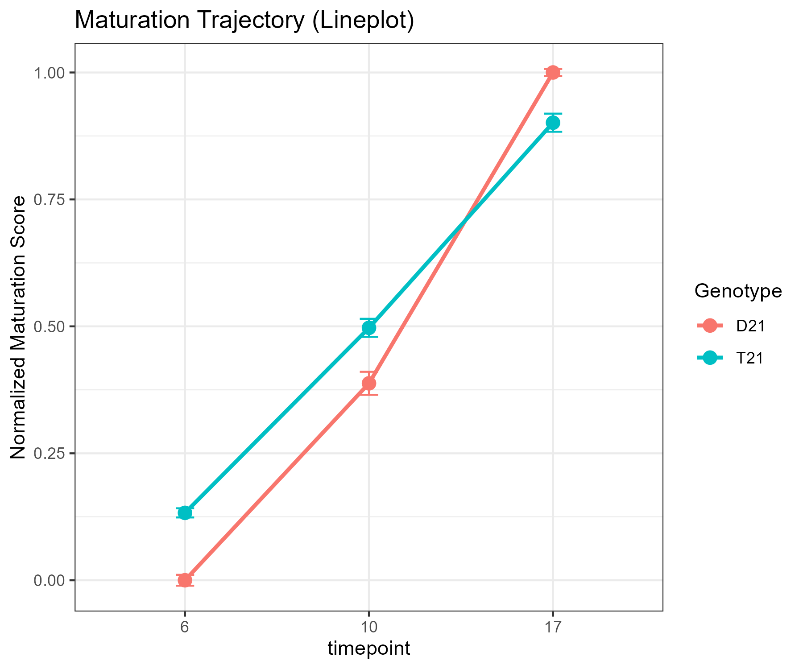

# Maturation Score Workflow

Repo for calculating a PCA-based Maturation Score. Basically projecting samples onto a trajectory defined by a control timecourse.

## Overview

1.  **Find Dynamic Genes**: Run LRT on control group (D21) to find stuff changing over time.
2.  **Define Trajectory**: PCA on those genes. Vector is Start (Day 6) to End (Day 17).
3.  **Score**: Project everyone onto that vector. 0 is Early, 1 is Late.

## Steps

Check `tutorial_workflow.Rmd` for the code.

### 1. Load & Prep

Loading metadata and counts. Making sure factors are right (Day 6 -> 10 -> 17).

```r
# Load libs
library(DESeq2)
library(ggplot2)
library(dplyr)

# Load data
metadata <- readRDS("dat/metadata/WC24_metadata_clean.rds")
raw_counts <- readRDS("dat/counts/raw/WC24_filt_raw_counts.rds")
vst_counts <- readRDS("dat/counts/vst/WC24_vst_counts.rds")
```

### 2. LRT

Finding top 1000 genes changing in D21 controls.

```r
# Subset D21
dds <- DESeqDataSetFromMatrix(countData = raw_ctrl, colData = meta_ctrl, design = ~ timepoint)
dds <- DESeq(dds, test = "LRT", reduced = ~ 1)

# Top 1000
res <- results(dds)
top_genes <- rownames(res[order(res$padj), ])[1:1000]
```

### 3. PCA & Vector

PCA on those genes. Defining the vector from Day 6 centroid to Day 17 centroid.

```r
# Centroids
origin <- centroids %>% filter(timepoint == 6)
endpoint <- centroids %>% filter(timepoint == 17)

# Vector
ref_vec <- endpoint_vec - origin_vec
```

### 4. Plots

#### Trajectory

Samples in PC space. Arrow is the maturation path.



#### Scores

Normalized scores (0-1).

**Barplot:**
<br>


**Trajectory:**
<br>


## Usage

1.  Clone this.
2.  Data goes in `dat/`.
3.  Run `tutorial_workflow.Rmd`.

## Deps
- R
- DESeq2
- ggplot2
- dplyr
- tibble
- tidyr
- scatterplot3d
